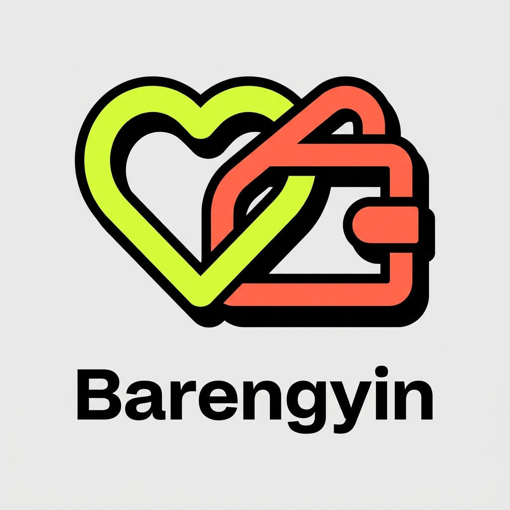
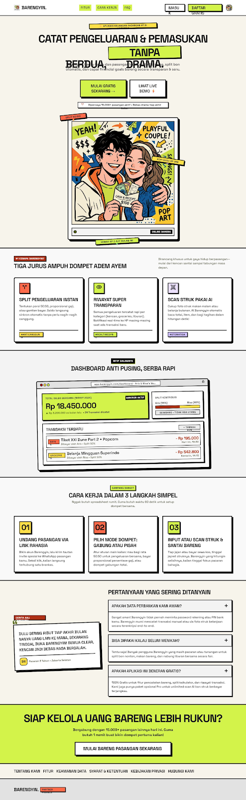
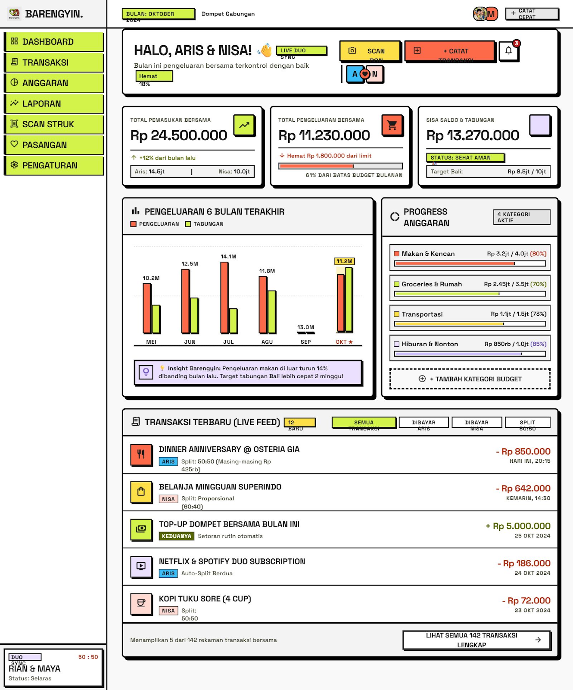
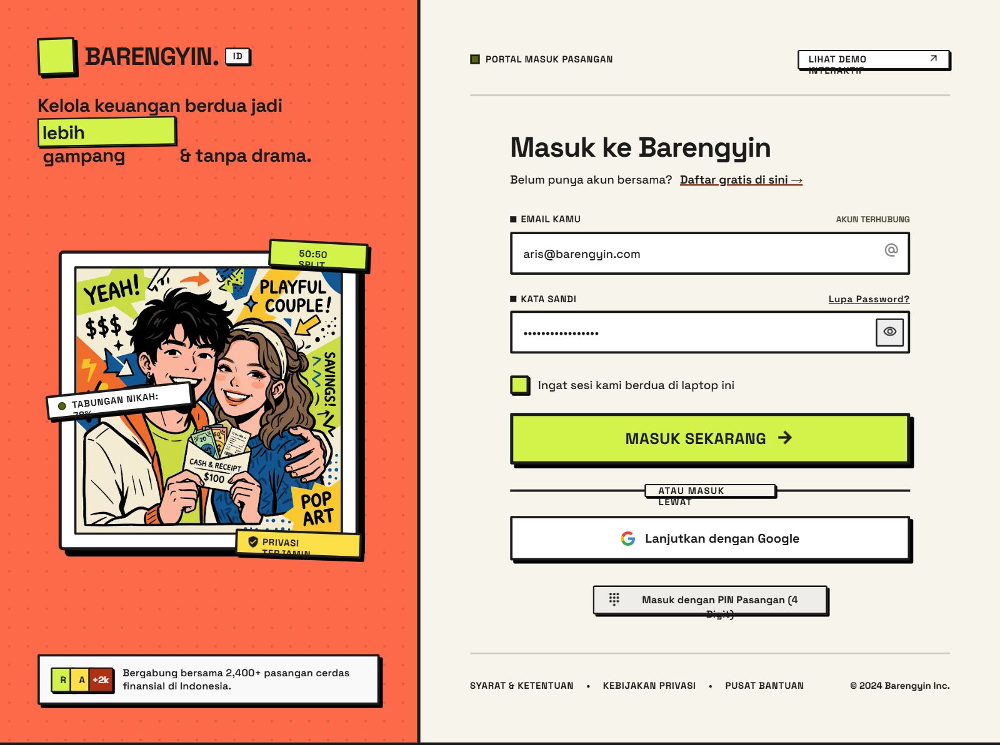

<div align="center">
  
  <h1>Barengyin</h1>
  <p><strong>Kelola uang berdua dengan lebih transparan, ringan, dan tanpa drama.</strong></p>
  <p>
    Barengyin adalah aplikasi keuangan pasangan untuk mencatat pemasukan dan
    pengeluaran, memantau saldo bersama, menabung menuju target, serta mengubah
    foto struk menjadi transaksi dengan bantuan AI.
  </p>
  <p>
    <a href="https://nextjs.org"></a>
    <a href="https://react.dev"></a>
    <a href="https://supabase.com"></a>
    <a href="https://www.typescriptlang.org"></a>
    
  </p>
</div>

> [!IMPORTANT]
> Barengyin masih dalam tahap pengembangan aktif. Proyek ini cocok untuk
> development dan evaluasi MVP, tetapi belum siap digunakan untuk menyimpan
> data finansial produksi sebelum hardening RLS, endpoint, dan alur PIN selesai.

## Preview

<p align="center">
  
  
</p>

<p align="center">
  
  
</p>

## Mengapa Barengyin?

Keuangan bersama sering tersebar di chat, catatan pribadi, dan ingatan
masing-masing. Barengyin menyatukannya dalam satu ruang pasangan agar keduanya
bisa melihat konteks yang sama: uang masuk, pengeluaran, siapa yang membayar,
anggaran, dan target yang sedang dikejar.

- **Satu ruang untuk berdua** — undang pasangan melalui link dan PIN.
- **Pencatatan transparan** — simpan pemasukan dan pengeluaran beserta pembayar,
  kategori, tanggal, dan metode split.
- **Scan struk dengan AI** — ekstrak merchant, nominal, kategori, dan item dari
  foto sebelum transaksi dikonfirmasi.
- **Target tabungan bersama** — buat target, tambah setoran, dan lihat riwayat
  kontribusi.
- **Dashboard dan laporan** — pantau arus kas, komposisi pengeluaran, tren enam
  bulan, dan laporan yang dapat dicetak.
- **Antarmuka khas** — desain *kinetic neo-brutalist* yang playful, tegas, dan
  responsif.

## Status fitur

| Area | Status | Keterangan |
|---|:---:|---|
| Autentikasi email dan password | ✅ | Daftar, masuk, keluar, serta proteksi halaman aplikasi |
| Couple Space dan undangan | ✅ | Link undangan, PIN pasangan, dan alur bergabung |
| Transaksi | ✅ | Tambah, ubah, hapus, cari, dan filter dasar |
| Dompet bersama | ✅ | Pemasukan, pengeluaran, dan saldo berbasis transaksi |
| Target tabungan | ✅ | Target, setoran, progres, dan riwayat kontribusi |
| Scan struk AI | 🧪 | OCR dan form konfirmasi tersedia; penyimpanan artefak scan masih dikembangkan |
| Laporan | 🧪 | Statement, analitik kategori, dan print tersedia; ekspor PDF/CSV native belum tersedia |
| Anggaran | 🧪 | UI tersedia; persistence database dan periodisasi belum selesai |
| Split proporsional | 🧪 | Pilihan metode tersedia; detail porsi per pengguna belum menjadi sumber data utama |
| Realtime dan notifikasi | 🗺️ | Schema awal tersedia; subscription dan notification center belum selesai |
| Mode dompet terpisah | 🗺️ | Opsi tersedia; pemisahan wallet dan saldo per pengguna masih dalam roadmap |

Keterangan: ✅ tersedia, 🧪 sedang disempurnakan, 🗺️ roadmap.

## Tech stack

- **Web:** Next.js 16 App Router, React 19, TypeScript
- **Styling:** Tailwind CSS 4 dan design system Kinetic Neo-Brutalist Duo
- **Database & Auth:** Supabase PostgreSQL, Auth, RLS, Storage, dan Realtime
- **AI Vision:** Qwen-VL melalui DashScope atau Anthropic Claude
- **Bot protection:** Cloudflare Turnstile
- **Observability:** Vercel Analytics dan Speed Insights
- **Client cryptography:** Web Crypto API

## Arsitektur singkat

```text
Browser
  ├─ Next.js App Router pages
  ├─ Supabase browser client ────────┐
  └─ Route handlers                  │
       ├─ Turnstile verification     ├─ Supabase Auth + PostgreSQL
       ├─ Couple PIN operations      ├─ Supabase Storage
       └─ Receipt AI extraction ─────┘
                         └───────────── Qwen / Anthropic API
```

Data utama dipisahkan berdasarkan `couple_id`. Setiap pengguna memiliki profil,
bergabung ke sebuah Couple Space, lalu berbagi transaksi, tabungan, anggaran,
dan laporan di dalam ruang tersebut.

Dokumen produk yang lebih lengkap tersedia di:

- [Product Requirements Document](documentation/PRD.md)
- [Entity Relationship Diagram](documentation/ERD.md)
- [Design System](documentation/DESIGN.md)
- [Dokumentasi Scan Struk](Vision%20Struk/SCAN-STRUK-IMPLEMENTATION.md)

## Menjalankan secara lokal

### Prasyarat

- Node.js **20.9 atau lebih baru**
- [pnpm](https://pnpm.io) versi terbaru
- Proyek Supabase
- API key Qwen atau Anthropic jika ingin mencoba scan struk
- Cloudflare Turnstile untuk konfigurasi production

### 1. Clone dan install dependency

```bash
git clone https://github.com/gabrielutomo/barengyin.git
cd barengyin
corepack enable
pnpm install
```

### 2. Siapkan environment

Salin template environment:

```bash
cp .env.example .env.local
```

Untuk PowerShell:

```powershell
Copy-Item .env.example .env.local
```

Isi variabel yang diperlukan:

| Variabel | Wajib | Kegunaan |
|---|:---:|---|
| `NEXT_PUBLIC_SUPABASE_URL` | Ya | URL proyek Supabase |
| `NEXT_PUBLIC_SUPABASE_ANON_KEY` | Ya | Public/anon key untuk browser client |
| `SUPABASE_SERVICE_ROLE_KEY` | Ya | Operasi server dengan hak khusus; jangan pernah diekspos ke browser |
| `AI_PROVIDER` | Tidak | `qwen` sebagai default atau `claude` |
| `QWEN_API_KEY` | Kondisional | Wajib jika memakai Qwen |
| `QWEN_BASE_URL` | Tidak | Endpoint DashScope Anthropic-compatible |
| `QWEN_VL_MODEL` | Tidak | Model Qwen Vision yang digunakan |
| `ANTHROPIC_API_KEY` | Kondisional | Wajib jika memakai Claude |
| `NEXT_PUBLIC_TURNSTILE_SITE_KEY` | Production | Site key Cloudflare Turnstile |
| `TURNSTILE_SECRET_KEY` | Production | Secret key Cloudflare Turnstile |
| `TURNSTILE_HOSTNAMES` | Disarankan | Daftar hostname production yang diizinkan |
| `NEXT_PUBLIC_APP_URL` | Tidak | Base URL untuk membuat link undangan |

> [!CAUTION]
> Jangan menggunakan `SUPABASE_SERVICE_ROLE_KEY`, `TURNSTILE_SECRET_KEY`, atau
> API key AI pada variabel yang diawali `NEXT_PUBLIC_`.

### 3. Siapkan database Supabase

Proyek saat ini masih memakai snapshot SQL, belum migration history penuh.

1. Buka **SQL Editor** pada dashboard Supabase.
2. Jalankan [`supabase/schema.sql`](supabase/schema.sql) untuk database baru.
3. [`supabase/patch.sql`](supabase/patch.sql) hanya ditujukan untuk instalasi lama
   yang belum memiliki kolom tambahan.

Gunakan konfigurasi ini hanya untuk development. Sebelum production, perketat
RLS agar setiap operasi benar-benar dibatasi berdasarkan keanggotaan
`couple_id`, jadikan bucket struk private, dan tambahkan pengujian allow/deny.

### 4. Jalankan development server

```bash
pnpm dev
```

Buka [http://localhost:3000](http://localhost:3000).

## Perintah proyek

| Perintah | Fungsi |
|---|---|
| `pnpm dev` | Menjalankan development server |
| `pnpm build` | Membuat production build |
| `pnpm start` | Menjalankan hasil production build |
| `pnpm lint` | Menjalankan ESLint |
| `pnpm exec tsc --noEmit` | Memeriksa tipe TypeScript tanpa menghasilkan file |

## Struktur direktori

```text
barengyin/
├─ app/                    # Pages dan route handlers Next.js
│  ├─ api/                 # Couple PIN, scan receipt, dan Turnstile
│  ├─ dashboard/           # Ringkasan keuangan
│  ├─ transaksi/           # CRUD transaksi
│  ├─ dompet/              # Saldo dan pemasukan
│  ├─ anggaran/            # Pengelolaan budget
│  ├─ tabungan/            # Target dan kontribusi tabungan
│  ├─ laporan/             # Statement dan analitik
│  └─ scan-struk/          # Upload, OCR, review, dan simpan transaksi
├─ components/             # Sidebar, chart, Turnstile, dan UI primitives
├─ lib/                    # Currency, PIN vault, AI, dan helper Supabase
├─ utils/supabase/         # Browser, server, middleware, dan admin clients
├─ supabase/               # Snapshot schema dan patch SQL
├─ documentation/          # PRD, ERD, dan design system
└─ public/assets/          # Logo, ilustrasi, dan preview aplikasi
```

## Checklist sebelum production

- [ ] Terapkan RLS per operasi dan per `couple_id`
- [ ] Hapus fallback/bypass Turnstile di luar development
- [ ] Tambahkan rate limit pada endpoint PIN dan AI
- [ ] Pisahkan PIN perangkat dari kode bergabung pasangan
- [ ] Gunakan private Storage bucket untuk gambar struk
- [ ] Pindahkan schema ke migration versioned dan tambahkan database test
- [ ] Tambahkan pagination untuk transaksi dan laporan
- [ ] Tambahkan unit, integration, RLS, dan end-to-end test
- [ ] Selesaikan halaman kebijakan privasi dan syarat penggunaan
- [ ] Pastikan `pnpm lint`, type-check, dan `pnpm build` berhasil di CI

## Deployment

Target deployment utama adalah Vercel.

1. Selesaikan checklist production di atas.
2. Hubungkan repository ke Vercel.
3. Tambahkan seluruh environment variable pada project settings.
4. Pastikan production URL tercantum dalam konfigurasi Supabase Auth dan
   `TURNSTILE_HOSTNAMES`.
5. Jalankan smoke test untuk login, undangan pasangan, transaksi, scan struk,
   dan logout setelah deployment selesai.

## Roadmap

- Database-backed monthly budgets
- Split fleksibel dengan nominal dan persentase per pasangan
- Settlement: siapa berutang dan siapa menerima
- Supabase Realtime untuk transaksi dan target tabungan
- Notification center dan budget warning
- Multi-wallet serta mode dompet terpisah
- Ekspor laporan PDF dan CSV
- Google OAuth dan reset password
- PWA dan pengalaman mobile yang lebih native

## Kontribusi

Kontribusi, laporan bug, dan ide produk sangat diterima.

1. Fork repository ini.
2. Buat branch dari `main`.
3. Lakukan perubahan kecil dan terfokus.
4. Jalankan lint, type-check, dan build.
5. Buka pull request dengan penjelasan masalah dan solusi.

---

<div align="center">
  <p>
    Dibuat untuk pasangan Indonesia yang ingin membicarakan uang dengan lebih
    jujur dan lebih ringan. 💛
  </p>
</div>
