# Entity Relationship Diagram (ERD)
## Barengyin — Database Schema (Supabase / PostgreSQL)

**Versi Dokumen:** 1.0
**Terkait:** PRD Barengyin v1.0

Catatan desain schema:
- `auth.users` adalah tabel bawaan **Supabase Auth**; tabel `profiles` di bawah adalah tabel publik yang extend data user (1:1 dengan `auth.users`).
- Semua tabel domain (wallet, transaksi, budget, dst.) di-scope oleh `couple_id` agar Row Level Security (RLS) Supabase bisa membatasi akses hanya untuk 2 anggota Couple Space terkait.
- PIN 4 digit disimpan dalam bentuk hash (`pin_hash`), tidak pernah plaintext.

---

## 1. Diagram Relasi (Mermaid ERD)

```mermaid
erDiagram
    AUTH_USERS ||--o| PROFILES : "extends"
    PROFILES ||--o{ COUPLE_MEMBERS : "joins"
    COUPLES ||--o{ COUPLE_MEMBERS : "has"
    COUPLES ||--o{ COUPLE_INVITES : "generates"
    COUPLES ||--o{ WALLETS : "owns"
    COUPLES ||--o{ CATEGORIES : "defines"
    COUPLES ||--o{ BUDGETS : "sets"
    COUPLES ||--o{ SAVINGS_GOALS : "targets"
    COUPLES ||--o{ TRANSACTIONS : "records"
    COUPLES ||--o{ NOTIFICATIONS : "receives"

    WALLETS ||--o{ TRANSACTIONS : "contains"
    CATEGORIES ||--o{ TRANSACTIONS : "classifies"
    CATEGORIES ||--o{ BUDGETS : "tracked_by"
    PROFILES ||--o{ TRANSACTIONS : "paid_by (payer)"
    PROFILES ||--o{ TRANSACTIONS : "created_by (creator)"
    TRANSACTIONS ||--o{ TRANSACTION_SPLITS : "split_into"
    PROFILES ||--o{ TRANSACTION_SPLITS : "owes/owed"
    TRANSACTIONS ||--o| RECEIPT_SCANS : "sourced_from"
    SAVINGS_GOALS ||--o{ SAVINGS_CONTRIBUTIONS : "accumulates"
    PROFILES ||--o{ SAVINGS_CONTRIBUTIONS : "contributes"

    AUTH_USERS {
        uuid id PK
        text email
        text encrypted_password
        timestamptz created_at
    }

    PROFILES {
        uuid id PK "FK -> auth.users.id"
        text full_name
        text avatar_url
        text pin_hash "nullable, hashed 4-digit PIN"
        text theme_color "avatar tag color e.g. blue/pink"
        timestamptz created_at
        timestamptz updated_at
    }

    COUPLES {
        uuid id PK
        text name "e.g. Dompet Aris & Nisa"
        text wallet_mode "enum: combined | separate"
        numeric default_split_ratio_a "e.g. 50.00"
        numeric default_split_ratio_b "e.g. 50.00"
        text currency "default IDR"
        uuid created_by FK "-> profiles.id"
        timestamptz created_at
    }

    COUPLE_MEMBERS {
        uuid id PK
        uuid couple_id FK
        uuid profile_id FK
        text role "enum: owner | partner"
        timestamptz joined_at
    }

    COUPLE_INVITES {
        uuid id PK
        uuid couple_id FK
        text invite_token "unique, random"
        uuid invited_by FK "-> profiles.id"
        text status "enum: pending | accepted | expired | revoked"
        timestamptz expires_at
        timestamptz created_at
    }

    WALLETS {
        uuid id PK
        uuid couple_id FK
        text name "e.g. Dompet Gabungan"
        text type "enum: shared | individual"
        uuid owner_profile_id FK "nullable, filled if type=individual"
        numeric current_balance
        timestamptz created_at
    }

    CATEGORIES {
        uuid id PK
        uuid couple_id FK
        text name "e.g. Makan & Kencan"
        text icon "material symbol name"
        text color_hex
        text type "enum: expense | income"
        boolean is_default
        timestamptz created_at
    }

    TRANSACTIONS {
        uuid id PK
        uuid couple_id FK
        uuid wallet_id FK
        uuid category_id FK
        uuid paid_by FK "-> profiles.id, nullable if type=income_both"
        uuid created_by FK "-> profiles.id"
        text title "e.g. Dinner Anniversary @ Osteria Gia"
        text description "nullable"
        text type "enum: expense | income"
        numeric amount "total nominal"
        text split_method "enum: none | fifty_fifty | proportional | full_by_payer | shared_pool"
        text status "enum: recorded | pending_review"
        uuid receipt_scan_id FK "nullable"
        timestamptz transaction_date
        timestamptz created_at
    }

    TRANSACTION_SPLITS {
        uuid id PK
        uuid transaction_id FK
        uuid profile_id FK
        numeric share_amount "nominal porsi profile ini"
        numeric share_percentage "nullable, e.g. 50.00 / 60.00"
        boolean is_settled
        timestamptz created_at
    }

    RECEIPT_SCANS {
        uuid id PK
        uuid couple_id FK
        uuid uploaded_by FK "-> profiles.id"
        text image_url "Supabase Storage path"
        jsonb ai_extracted_data "raw hasil parsing Claude Vision API"
        text status "enum: processing | completed | failed"
        timestamptz created_at
    }

    BUDGETS {
        uuid id PK
        uuid couple_id FK
        uuid category_id FK
        numeric limit_amount
        text period "enum: monthly | weekly | custom"
        date period_start
        date period_end
        timestamptz created_at
    }

    SAVINGS_GOALS {
        uuid id PK
        uuid couple_id FK
        text name "e.g. Target Bali"
        numeric target_amount
        numeric current_amount
        date target_date "nullable"
        text status "enum: active | achieved | archived"
        timestamptz created_at
    }

    SAVINGS_CONTRIBUTIONS {
        uuid id PK
        uuid savings_goal_id FK
        uuid profile_id FK
        numeric amount
        timestamptz contributed_at
    }

    NOTIFICATIONS {
        uuid id PK
        uuid couple_id FK
        uuid recipient_profile_id FK
        text type "enum: new_transaction | budget_warning | goal_milestone | invite_accepted"
        text title
        text body
        jsonb metadata "nullable, e.g. related transaction_id"
        boolean is_read
        timestamptz created_at
    }
```

---

## 2. Penjelasan Entitas Kunci

| Entitas | Peran dalam Sistem |
|---|---|
| `profiles` | Data publik pengguna (nama, avatar, PIN hash) — 1:1 dengan `auth.users` milik Supabase Auth |
| `couples` | "Couple Space" — unit inti yang menyatukan 2 pengguna; menyimpan mode dompet (gabung/pisah) dan rasio split default |
| `couple_members` | Tabel junction yang menghubungkan `profiles` ke `couples`; membatasi maksimal 2 anggota aktif per couple (divalidasi di application layer / trigger) |
| `couple_invites` | Mekanisme undangan via link rahasia dengan token unik dan masa berlaku |
| `wallets` | Dompet — bisa `shared` (1 dompet untuk couple) atau `individual` (per profile), sesuai pilihan mode dompet |
| `categories` | Kategori transaksi (Makan & Kencan, Groceries, Transportasi, dll.), scoped per couple agar bisa dikustomisasi |
| `transactions` | Catatan transaksi inti — pengeluaran atau pemasukan, terhubung ke wallet, kategori, dan pembayar |
| `transaction_splits` | Detail pembagian porsi tiap transaksi per profile — mendukung split 50:50, proporsional, atau custom |
| `receipt_scans` | Menyimpan hasil scan struk (gambar + data mentah hasil ekstraksi AI) sebelum dikonfirmasi jadi `transactions` |
| `budgets` | Batas anggaran per kategori per periode (bulanan/mingguan) |
| `savings_goals` & `savings_contributions` | Target tabungan bersama (misal "Target Bali") dan riwayat kontribusi tiap pasangan ke target tersebut |
| `notifications` | Notifikasi in-app: transaksi baru, peringatan budget, milestone tabungan, dll. |

---

## 3. Aturan Bisnis Penting yang Direfleksikan di Skema

1. **Split fleksibel** — `transactions.split_method` menentukan strategi, sementara detail nominal per orang disimpan granular di `transaction_splits`, sehingga laporan "siapa berkontribusi berapa" (seperti di stat card "Aris: 14.5jt | Nisa: 10.0jt") bisa dihitung akurat.
2. **Mode dompet gabung vs pisah** — direpresentasikan lewat `couples.wallet_mode` dan `wallets.type`; ketika `separate`, tiap `wallets` row punya `owner_profile_id`, tapi tetap satu `couple_id` sehingga laporan gabungan tetap bisa dihitung lintas wallet.
3. **Scan struk sebagai staging area** — `receipt_scans` terpisah dari `transactions` agar hasil AI bisa direview/dikoreksi pengguna dulu sebelum resmi tercatat (`transactions.receipt_scan_id` sebagai referensi balik).
4. **PIN pasangan** — disimpan di level `profiles.pin_hash`, bukan di level couple, karena tiap orang punya PIN individu untuk login cepat di perangkat bersama.
5. **RLS Supabase** — semua query ke tabel domain (`transactions`, `budgets`, `wallets`, dst.) difilter melalui kebijakan RLS berbasis `couple_id IN (SELECT couple_id FROM couple_members WHERE profile_id = auth.uid())`, memastikan data satu couple tidak bisa diakses couple lain.

---

## 4. Indeks yang Direkomendasikan

- `transactions (couple_id, transaction_date DESC)` — untuk query "Transaksi Terbaru" dan filter laporan bulanan.
- `transactions (couple_id, category_id)` — untuk agregasi progress anggaran per kategori.
- `transaction_splits (transaction_id)` dan `transaction_splits (profile_id)` — untuk rekap kontribusi per orang.
- `couple_invites (invite_token)` — unique index untuk lookup cepat saat pasangan membuka link undangan.
- `notifications (recipient_profile_id, is_read, created_at DESC)` — untuk badge notifikasi & daftar terbaru.
